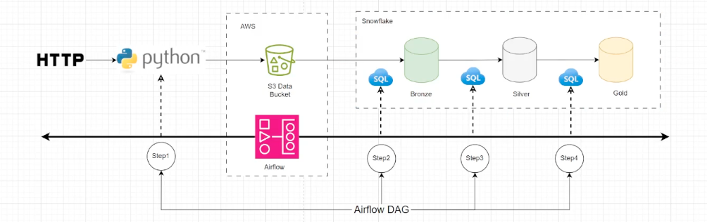

# ELT-Airflow-Snowflake

**Objective:**
Apache airflow as the core orchestration engine in a modern ELT, which is extract, load and transform data pipeline, leveraging the medallion architecture - bronze, silver, and gold. We will implement data ingestion, data loading and data transformation and scheduling across cloud native tools like AWS S3, snowflake and Python using Apache airflow. 

In today's data driven world, the ability to orchestrate reliable and modular pipeline is essential, and Apache airflow has become the standard for orchestrating ETL workflows, offering flexibility, observability and extensibility.

**Steps:**
1. With the airflow orchestrating each step, data is first ingested using a Python script from an HTTP URL. 
2. Then we will restore that data into an S3 bucket, in it's raw format. 
3. Then this raw data gets loaded into the bronze layer of a snowflake by running the copy command with the same airflow dag, which we are going to create.
4. the airflow is going to run a transformation, which is going to clean and normalize the data into the silver layer using SQL stored procedure.
5. And finally, the same DAG can be used to trigger a sql stored procedure in snowflake to perform the business logic and aggregation, which is going to be applied on the gold layer producing data ready for any sort of analytics.
6. Testing the workflow architecture built.
